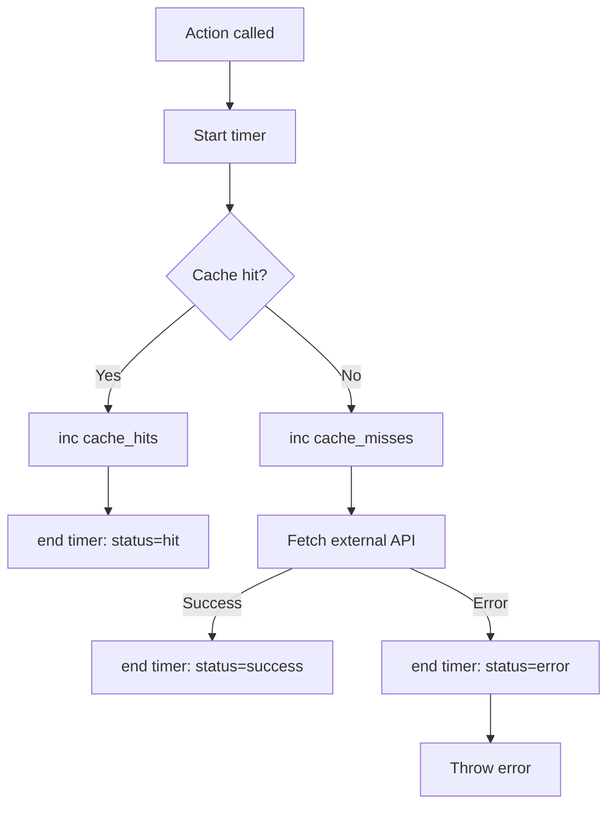

# Application Metrics in Wassup

## Overview

Wassup exposes Prometheus-compatible metrics via `prom-client`, scraped by Prometheus every 30 seconds. The instrumentation covers three layers:

1. **Server action performance** — latency histograms for each data-fetching action
2. **Cache effectiveness** — hit/miss counters for all LRU caches
3. **Node.js runtime** — heap usage, event loop lag, GC pauses (auto-collected)

```
┌──────────────────────────────────────────────────────────────┐
│                       Wassup (Next.js)                       │
│                                                              │
│      Server Actions                  /api/metrics            │
│      ┌────────────┐                  ┌──────────┐            │
│      │ weather    │──┐               │ prom-    │            │
│      │ feed       │  │ Histogram     │ client   │◄── GET     │
│      │ reddit     │  ├─► duration    │ Registry │            │
│      │ youtube    │  │   + cache     └────┬─────┘            │
│      │ github     │  │   counters         │                  │
│      │ hackernews │──┘                    │                  │
│      └────────────┘                       │                  │
└───────────────────────────────────────────┼──────────────────┘
                                            │
                                 scrape every 30s
                                            │
                                            ▼
                                  ┌──────────────────┐
                                  │    Prometheus     │
                                  └──────────────────┘
```

---

## Core Concepts

### Prometheus Metric Types

Prometheus defines four core metric types. Wassup uses two:

| Type | What It Measures | Wassup Usage |
|---|---|---|
| **Counter** | Monotonically increasing value (only goes up) | Cache hits, cache misses |
| **Histogram** | Distribution of values in configurable buckets | Server action duration |
| Gauge | Current value (can go up or down) | Used by default metrics (heap size, active handles) |
| Summary | Like histogram but calculates quantiles client-side | Not used |

**Why Histogram over Summary?**

Histograms are aggregatable across instances. Summaries compute quantiles on the client, which cannot be aggregated if you ever scale to multiple pods. For a single instance like Wassup, either works, but Histogram is the industry default.

### Metric Naming Convention

Prometheus has strict naming conventions:

```
<namespace>_<name>_<unit>

wassup_server_action_duration_seconds    ← ✅ correct
wassup_serverActionDurationMs            ← ❌ no camelCase, no abbreviations
```

Rules:
- Snake_case only
- Include unit suffix (`_seconds`, `_bytes`, `_total` for counters)
- Namespace prefix to avoid collisions (`wassup_`)
- Labels for dimensions, not metric name (`action="weather"` not `weather_duration`)

### Labels

Labels add dimensions to metrics. A single metric with labels becomes many time series:

```
wassup_cache_hits_total{cache="weather"}    → separate time series
wassup_cache_hits_total{cache="reddit"}     → separate time series
wassup_cache_hits_total{cache="github"}     → separate time series
```

**Cardinality warning:** Every unique label combination creates a new time series. Never use unbounded values as labels (user IDs, URLs, timestamps). Wassup's labels are all bounded enums (`action`, `cache`, `status`).

---

## Architecture

### File Structure

```
src/
├── lib/metrics.ts                    # Registry + metric definitions (singleton)
├── app/api/metrics/route.ts          # GET handler → Prometheus text format
└── features/
    ├── weather/services/weather.actions.ts    # Instrumented
    ├── feed/services/rss.actions.ts           # Instrumented (batch fetch)
    ├── feed/services/thumbnail.actions.ts     # Thumbnail scraping (concurrency-limited)
    ├── reddit/services/reddit.actions.ts      # Instrumented
    ├── youtube/services/youtube.actions.ts    # Instrumented
    ├── github/services/github.actions.ts      # Instrumented (stale-aware)
    ├── hackernews/services/hackernews.actions.ts  # Instrumented
    └── tabs/services/tabs.actions.ts          # Orchestrates child widget fetches
```

### Metric Definitions

| Metric Name | Type | Labels | Buckets |
|---|---|---|---|
| `wassup_server_action_duration_seconds` | Histogram | `action`, `status` | 0.05, 0.1, 0.25, 0.5, 1, 2, 5, 10 |
| `wassup_cache_hits_total` | Counter | `cache` | — |
| `wassup_cache_misses_total` | Counter | `cache` | — |
| + Node.js default metrics | Various | Various | — |

**Action labels:** `weather`, `feed`, `feed_batch`, `reddit`, `youtube`, `github`, `hackernews`

**Note:** The `tabs` action orchestrates child widget fetches (delegates to other actions) and the `thumbnail` action handles RSS image scraping — neither defines its own Prometheus timer, they inherit timing from the child actions they call.

**Status labels:** `hit` (cache fresh), `stale` (cache served but stale), `success` (fetched), `error` (failed)

---

## How It Works

### The globalThis Singleton Pattern

```typescript
const globalForMetrics = globalThis as unknown as {
  __metrics: { register: Registry; serverActionDuration: Histogram; ... };
};

const metrics = (globalForMetrics.__metrics ??= (() => {
  const register = new Registry();
  collectDefaultMetrics({ register });
  // ... create Histogram, Counter instances
  return { register, serverActionDuration, cacheHits, cacheMisses };
})());

export const { register, serverActionDuration, cacheHits, cacheMisses } = metrics;
```

**Why this is necessary:**

Next.js dev mode uses Hot Module Replacement (HMR). When you save a file, the module is re-evaluated. Without the `globalThis` guard:

```
Save file → Module re-evaluates → new Histogram("same_name") → 💥 Error: "metric already registered"
```

The `??=` (nullish coalescing assignment) ensures the registry is created only once and survives HMR reloads. This is the same pattern used for Prisma clients in Next.js applications.

In production, bundling creates a single module instance, so the guard is redundant but harmless.

### Instrumentation Pattern

All server actions follow the same pattern:



The `startTimer` / `end` pattern from `prom-client` records the elapsed time in the Histogram:

```typescript
const end = histogram.startTimer({ action: "weather" });
// ... do work ...
end({ status: "success" }); // records duration + adds status label
```

### GitHub Stale-While-Revalidate

GitHub's action has three return paths instead of two:

```
Fresh cache  → status="hit"     → immediate return
Stale cache  → status="stale"   → immediate return + background refresh
No cache     → status="success" → blocking fetch
```

The background refresh is fire-and-forget — it's not timed because the user-facing latency is what matters for SLOs.

### Scrape Pipeline

```
1. Prometheus sends GET /api/metrics every 30s
2. prom-client serializes all registered metrics to Prometheus text format
3. Prometheus parses and stores the time series
4. Grafana queries the stored data for visualization
```

Prometheus text format example:

```
# HELP wassup_server_action_duration_seconds Duration of server action calls
# TYPE wassup_server_action_duration_seconds histogram
wassup_server_action_duration_seconds_bucket{action="weather",status="success",le="0.5"} 12
wassup_server_action_duration_seconds_bucket{action="weather",status="success",le="1"} 15
wassup_server_action_duration_seconds_bucket{action="weather",status="success",le="+Inf"} 15
wassup_server_action_duration_seconds_sum{action="weather",status="success"} 4.23
wassup_server_action_duration_seconds_count{action="weather",status="success"} 15
```

---

## Trade-offs & Limitations

| Aspect | Trade-off |
|---|---|
| **No HTTP-level metrics** | Next.js 16 doesn't expose clean hooks for route-level timing. Server actions are the true boundary for data-fetching work |
| **Public `/api/metrics`** | Endpoint is publicly accessible. Data is non-sensitive (durations, heap size). Acceptable for a personal project |
| **Histogram memory** | Each bucket × label combination = one float64. With 6 actions × 4 statuses × 8 buckets = 192 time series. Negligible (~15 KB) |
| **No client metrics** | Browser performance (render time, FCP, LCP) is not captured. Would require a separate browser-to-server reporting pipeline |
| **Counter reset on restart** | Counters reset to 0 on process restart. `rate()` and `increase()` functions handle this automatically in PromQL/MetricsQL |
| **Default metrics overhead** | `collectDefaultMetrics` adds ~30 metrics (heap, GC, event loop, file descriptors). Minimal CPU cost (~1ms per scrape) |

---

## Use Cases / Real Examples

### Diagnosing Slow Actions

Query p95 latency per action over the last hour:

```promql
histogram_quantile(0.95,
  rate(wassup_server_action_duration_seconds_bucket[1h])
)
```

If `github` shows 5s p95 while others show 200ms, it means the GitHub API is the bottleneck.

### Validating Cache Effectiveness

Cache hit ratio per provider:

```promql
rate(wassup_cache_hits_total[5m])
/ (rate(wassup_cache_hits_total[5m]) + rate(wassup_cache_misses_total[5m]))
```

Expected: >80% hit ratio after initial warmup (5-min TTL caches with repeated dashboard views).

### Detecting Memory Leaks

Node.js heap growth over time:

```promql
nodejs_heap_size_used_bytes
```

If this line trends upward without plateauing, there's a leak. The LRU caches are bounded (max entries), so they shouldn't cause unbounded growth.

### Correlating Errors with External APIs

Error rate by action:

```promql
rate(wassup_server_action_duration_seconds_count{status="error"}[5m])
```

A spike in `reddit` errors could indicate Reddit API issues, while `github` errors might signal rate limiting.

---

## Comparisons with Alternatives

### Metrics Libraries

| Library | Language | Approach | When to Use |
|---|---|---|---|
| **prom-client (Wassup)** | Node.js | Pull-based (Prometheus-compatible) | Node.js apps scraped by Prometheus/VM |
| **OpenTelemetry SDK** | Multi-language | Push + Pull, traces + metrics + logs | Microservices needing distributed tracing |
| **StatsD + Datadog** | Multi-language | Push-based (UDP) | Teams already using Datadog |
| **next-otel** | Next.js | OTEL integration for Next.js | When using Vercel's built-in observability |

**Why prom-client for Wassup:** Simplest path to Prometheus metrics. No collector sidecar needed. Prometheus scrapes directly. One dependency, no configuration beyond the registry.

### Instrumentation Strategies

| Strategy | Pros | Cons | Used By |
|---|---|---|---|
| **Manual wrapping (Wassup)** | Explicit, no magic, exact control over what's measured | Repetitive, must remember to instrument new actions | Apps with few instrumentation points |
| **Middleware/decorator** | Automatic, DRY | Less control, can miss action-specific labels | Express/Koa apps |
| **Auto-instrumentation (OTEL)** | Zero-code changes for HTTP/DB/DNS | Noisy, hard to filter, high cardinality | Large microservice fleets |
| **AOP/Proxy pattern** | Wrap classes automatically | Complex setup, TypeScript decorator limitations | Java/Spring applications |

Manual wrapping is the right choice for Wassup: 6 core instrumented server actions is a small, stable surface. The instrumentation code adds ~10 lines per action and is completely explicit.
