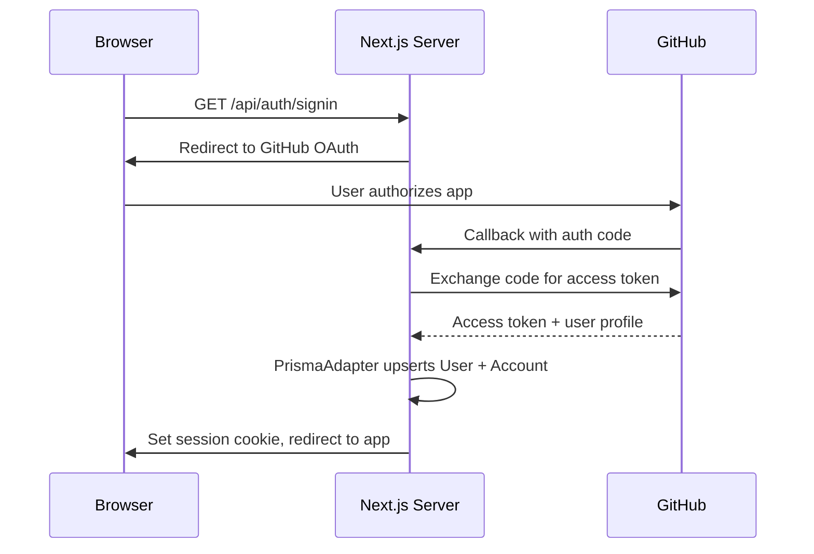
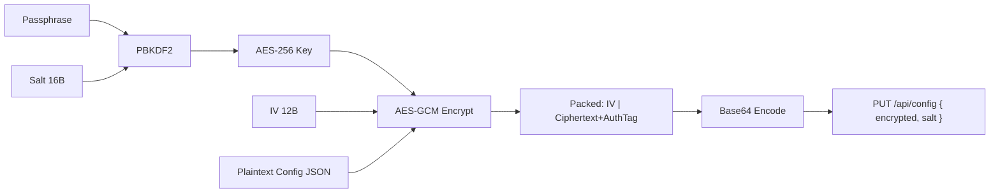
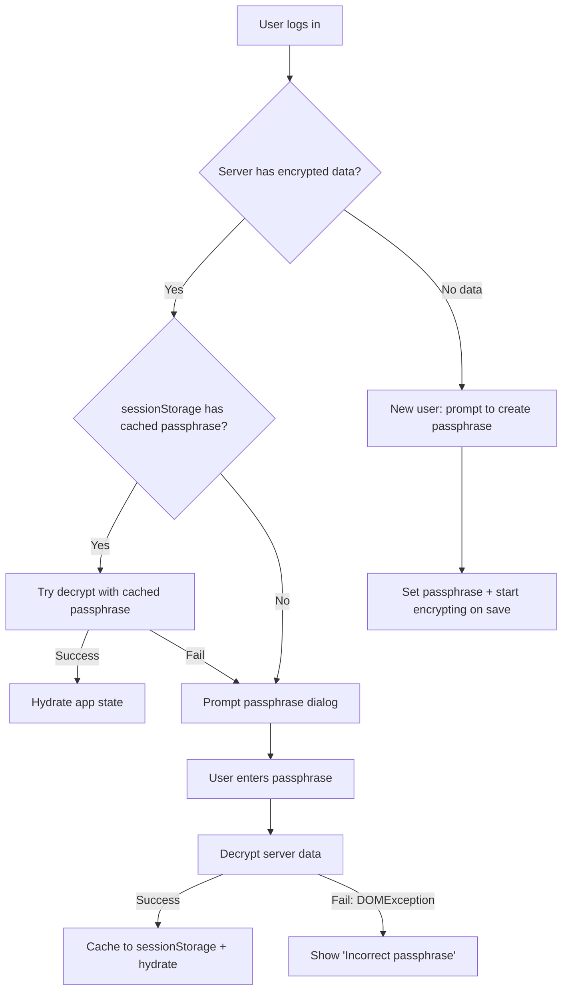

# Auth & Security in Wassup

## Overview

Wassup implements a layered security model combining three distinct concerns:

1. **Authentication** — GitHub OAuth via NextAuth.js, identifying who a user is
2. **Browser Execution Policy** — Content Security Policy (CSP) with nonces, controlling what the browser is allowed to load and execute
3. **Data Confidentiality** — Zero-knowledge encryption via Web Crypto API, ensuring the server never sees plaintext user data

These layers are independent and complement each other. A compromise in one does not immediately compromise the others.

```
┌─────────────────────────────────────────────────────────┐
│                      Browser                            │
│                                                         │
│  ┌──────────────┐  ┌──────────────┐  ┌────────────────┐ │
│  │ NextAuth.js  │  │   CSP Nonce  │  │  Web Crypto    │ │
│  │ Session      │  │   Middleware │  │  AES-256-GCM   │ │
│  └──────┬───────┘  └──────┬───────┘  └───────┬────────┘ │
│         │                 │                  │          │
│         ▼                 ▼                  ▼          │
│  "Who are you?"    "What can load?"  "Encrypt before    │
│                                       sending"          │
└─────────────────────────────────────────────────────────┘
          │                 │                  │
          ▼                 ▼                  ▼
┌─────────────────────────────────────────────────────────┐
│                      Server                             │
│                                                         │
│  Prisma/PostgreSQL stores:                               │
│  - User accounts (OAuth)                                │
│  - Encrypted config blobs (opaque to server)            │
└─────────────────────────────────────────────────────────┘
```

---

## Core Concepts

### 1. Authentication with NextAuth.js

NextAuth.js provides a battle-tested OAuth abstraction on top of Next.js. Wassup's configuration is minimal by design.

**Key architectural decisions:**

| Decision | Choice | Rationale |
|---|---|---|
| Provider | GitHub OAuth | Target audience is developers; GitHub is ubiquitous |
| Adapter | PrismaAdapter + PostgreSQL | Robust, Docker-managed, full SQL capabilities |
| Session strategy | Database sessions (default with adapter) | Sessions persist across server restarts |
| Test support | Credentials provider (gated by env var) | Enables E2E tests without real OAuth |

**How the auth flow works:**



**File structure:**

```
src/
├── lib/auth.ts                        # NextAuth config (providers, adapter, callbacks)
├── app/api/auth/[...nextauth]/route.ts # Catch-all API route
├── components/auth/LoginButton.tsx     # Client component (sign-in / user menu)
└── providers/SessionProvider.tsx       # NextAuthSessionProvider wrapper
```

**The test credentials pattern:**

The test-only Credentials provider is conditionally added, gated behind `ENABLE_TEST_CREDENTIALS=true`. This is a clean pattern because:
- It never ships to production (env var is only set in CI)
- It allows E2E tests to authenticate without hitting GitHub
- It returns a minimal user object that satisfies NextAuth's type contract

---

### 2. Content Security Policy (CSP)

CSP is a browser-enforced HTTP header that restricts which resources a page can load. It is the primary defense against **Cross-Site Scripting (XSS)**.

**How Wassup implements CSP:**

The CSP is generated per-request in `proxy.ts` (the Next.js middleware handler), using a **nonce-based** approach:

```
Request → Middleware generates nonce → CSP header includes nonce → Script tags must include nonce to execute
```

**Directive breakdown:**

| Directive | Value | Why |
|---|---|---|
| `default-src` | `'self'` | Baseline: only load resources from same origin |
| `script-src` | `'self' 'nonce-<random>' 'strict-dynamic'` | Only nonced scripts execute; `strict-dynamic` lets those scripts load further scripts |
| `style-src` | `'self' 'unsafe-inline'` | MUI injects `<style>` tags at runtime — unavoidable |
| `img-src` | `'self' https: data: blob:` | RSS feeds and Reddit embed external images |
| `font-src` | `'self'` | No external fonts |
| `connect-src` | `'self' https://api.open-meteo.com https://geocoding-api.open-meteo.com` | Explicit allowlist for weather API calls |
| `frame-ancestors` | `'none'` | Prevents clickjacking (no iframe embedding) |
| `form-action` | `'self' https://github.com` | OAuth redirect requires `github.com` |

**Common pitfalls encountered in Wassup:**

1. **`form-action` blocking OAuth** — The GitHub OAuth flow redirects via a form POST. Without `https://github.com` in `form-action`, the browser silently blocks the redirect. Error is only visible in browser console.

2. **`img-src` blocking RSS/Reddit images** — External content widgets embed images from arbitrary domains. The solution is `https:` (any HTTPS origin), accepting the trade-off of a looser `img-src` for functional content.

3. **`style-src 'unsafe-inline'`** — MUI's runtime style injection is incompatible with nonce-based style CSP. This is a known framework limitation. The mitigation is that `script-src` remains strict, which is the higher-value directive.

---

### 3. Zero-Knowledge Encryption

Zero-knowledge encryption means the server stores user data but **cannot read it**. The encryption and decryption happen entirely in the browser.

**Cryptographic primitives used:**

| Primitive | Specification | Purpose |
|---|---|---|
| PBKDF2 | 600,000 iterations, SHA-256 | Derives a 256-bit AES key from a user passphrase |
| AES-256-GCM | 12-byte IV, 128-bit auth tag | Authenticated encryption (confidentiality + integrity) |
| Random salt | 16 bytes (`crypto.getRandomValues`) | Ensures same passphrase produces different keys per user |
| Random IV | 12 bytes (`crypto.getRandomValues`) | Ensures same plaintext produces different ciphertext each time |

**Encryption flow:**



**Data format stored on server:**

```
┌───────────────────────────────────────────┐
│                Base64 blob                │
├──────────┬────────────────────────────────┤
│ IV (12B) │ Ciphertext + GCM Auth Tag      │
└──────────┴────────────────────────────────┘
```

The server also stores the `salt` (not secret — it's a public parameter). The passphrase is **never** sent to the server.

**Passphrase lifecycle:**



**Key design decisions:**

| Decision | Rationale |
|---|---|
| Passphrase cached in `sessionStorage` | Survives page refreshes within a tab, cleared on tab close |
| Salt reused on subsequent saves | Same passphrase → same derived key → avoids key proliferation |
| Fresh IV per encryption | Cryptographic requirement: never reuse IV with same key in GCM |
| 600,000 PBKDF2 iterations | OWASP 2023 recommendation for SHA-256 |
| Loop-based Base64 encoding | `String.fromCharCode(...spread)` blows the call stack on >50KB payloads |

---

## Architecture

The three security layers integrate into the application architecture as follows:

```
┌─────────────────────────────────────────────────────────────-┐
│                      Request Lifecycle                       │
│                                                              │
│  1. Incoming Request                                         │
│     │                                                        │
│     ▼                                                        │
│  2. Middleware (proxy.ts)                                    │
│     ├── Generate CSP nonce                                   │
│     ├── Attach nonce to request headers                      │
│     └── Set Content-Security-Policy response header          │
│     │                                                        │
│     ▼                                                        │
│  3. NextAuth Route Handler (/api/auth/[...nextauth])         │
│     ├── OAuth flow (GitHub)                                  │
│     ├── Session management                                   │
│     └── PrismaAdapter ↔ PostgreSQL                            │
│     │                                                        │
│     ▼                                                        │
│  4. Config API (/api/config)                                 │
│     ├── Auth check: reject if no session                     │
│     ├── CSRF validation: validateOrigin(request)             │
│     ├── Rate limiting: 30 req/min per user                   │
│     ├── GET: return encrypted blob from DB                   │
│     └── PUT: validate shape/size, store encrypted blob       │
│     │                                                        │
│     ▼                                                        │
│  5. Client (Browser)                                         │
│     ├── useEncryptedSync hook manages passphrase lifecycle   │
│     ├── client-crypto.ts handles encrypt/decrypt             │
│     └── AppConfigProvider dispatches decrypted state         │
└─────────────────────────────────────────────────────────────-┘
```

---

## How It Works (End-to-End)

### First-time user:
1. User clicks "Sign In" → GitHub OAuth flow → session created
2. `useEncryptedSync.hydrateFromServer()` calls `GET /api/config` → no data
3. Passphrase dialog opens (creation mode)
4. User sets passphrase → cached in `sessionStorage`
5. On config changes, `syncEncryptedState()` encrypts and `PUT`s to server

### Returning user (same tab):
1. Session exists, `sessionStorage` has cached passphrase
2. `GET /api/config` returns encrypted blob
3. `tryDecrypt()` succeeds with cached passphrase → state hydrated silently

### Returning user (new tab/device):
1. Session exists, no cached passphrase
2. Passphrase dialog opens (decryption mode)
3. User enters passphrase → decrypt → hydrate → cache

### Server compromise scenario:
- Attacker obtains: encrypted blob + salt
- Attacker does **not** have: passphrase
- Attacker must brute-force PBKDF2 (600K iterations) — computationally expensive

---

## Trade-offs & Limitations

| Aspect | Trade-off |
|---|---|
| **Passphrase recovery** | Impossible. If user forgets passphrase, data is permanently lost. No recovery mechanism exists by design |
| **`style-src 'unsafe-inline'`** | Weakens CSP for styles. Acceptable because MUI requires it, and `script-src` remains strict |
| **`img-src https:`** | Broadly allows any HTTPS image. Necessary for RSS/Reddit widgets that load images from arbitrary domains |
| **sessionStorage caching** | Passphrase exists in memory/sessionStorage during the session. A browser extension with full page access could read it |
| **No key rotation** | Changing passphrase requires decrypt-with-old → re-encrypt-with-new, which is not yet implemented |
| **Single-provider OAuth** | Only GitHub. Adding Google/GitLab requires additional CSP `form-action` entries and provider config |
| **PostgreSQL** | Docker service to manage alongside the app. Docker Compose handles lifecycle with health checks |

---

## Comparisons with Alternatives

### Authentication

| Approach | Pros | Cons | When to Use |
|---|---|---|---|
| **NextAuth.js (Wassup)** | Zero-config OAuth, built-in adapters, session management | Opinionated, version churn between v4→v5 | Most Next.js apps |
| **Clerk / Auth0** | Managed, pre-built UI, MFA | Cost at scale, vendor lock-in | Teams wanting zero auth code |
| **Custom JWT** | Full control, no dependencies | Must handle token refresh, CSRF, storage | APIs / microservices |
| **Supabase Auth** | Integrated with Supabase DB, row-level security | Tied to Supabase ecosystem | Supabase-native apps |

### Client-Side Encryption

| Approach | Pros | Cons | When to Use |
|---|---|---|---|
| **Web Crypto API (Wassup)** | Native browser API, no dependencies, hardware-accelerated | Async-only, limited algorithm support | Browser-based zero-knowledge apps |
| **libsodium.js** | More algorithms, streaming encryption | 200KB+ bundle size | Advanced crypto needs (e.g., key exchange) |
| **Stanford JS Crypto Library (SJCL)** | Mature, well-audited | Unmaintained, no streaming | Legacy projects |
| **Server-side encryption (at-rest)** | Simpler UX (no passphrase), key managed by server | Server can read data — not zero-knowledge | When trust model includes the server |

### CSP Strategy

| Approach | Pros | Cons | When to Use |
|---|---|---|---|
| **Nonce-based (Wassup)** | Most secure for dynamic apps, per-request randomness | Requires middleware, slightly complex | SSR apps with inline scripts |
| **Hash-based** | No middleware needed | Must know script content at build time | Fully static sites |
| **`unsafe-inline`** | Simple | Defeats the purpose of CSP for scripts | Never (for `script-src`) |
| **No CSP** | No effort | No XSS mitigation | Never in production |

---

## Real Examples from Wassup

### Example 1: CSP Blocking OAuth Redirect

**Symptom:** Clicking "Sign In" did nothing. No error in the UI.

**Root cause:** `form-action` directive was set to `'self'` only. The GitHub OAuth flow redirects via a form POST to `github.com`, which was blocked.

**Fix:** Added `https://github.com` to `form-action`:
```
form-action 'self' https://github.com
```

**Lesson:** CSP violations are silent in the UI. Always check the browser console for `Refused to send form data` errors.

### Example 2: Reddit Images Blocked by CSP

**Symptom:** Reddit widget showed post text but no thumbnails.

**Root cause:** `img-src` was restricted to `'self'`, blocking `external-preview.redd.it` and other Reddit CDN domains.

**Fix:** Broadened `img-src` to `'self' https: data: blob:`.

**Lesson:** Content aggregation widgets inherently conflict with strict `img-src` policies. The practical solution is to allow all HTTPS sources.

### Example 3: Infinite Re-render Loop in useEncryptedSync

This example is not a security vulnerability itself, but it is security-adjacent — a broken encryption sync hook compromises the entire data confidentiality layer.

**Symptom:** Switching presets caused the app to freeze and consume 100% CPU.

**Root cause:** `useEffect` in `AppConfigProvider` had unstable dependencies from `useEncryptedSync`, causing the effect to re-fire on every render, which triggered state updates, which triggered re-renders.

**Fix:** Stabilized `useCallback` dependencies in `useEncryptedSync` to ensure referential stability across renders.

**Lesson:** Custom hooks that return functions must ensure those functions have stable references (`useCallback` with minimal deps), especially when consumers place them in `useEffect` dependency arrays.
